# Clinic Admin Panel

This is a Next.js-based admin panel designed for managing a clinic's website content and internal operations. It allows staff to manage news, promotions, user accounts, doctor schedules, and patient queues.

## Features

*   **News & Promotions Management**: Staff can create, edit, and delete news and promotions.
    *   **Publishing**: Only staff with the **Doctor** role can publish news. All staff can create drafts.
    *   Promotions and news are intended for display on the public-facing clinic website.
    *   **AI Integration**: Uses **Gemini AI** to create news content and summaries, as well as promotional descriptions.
*   **User Management**:
    *   **Admin Only**: Create, modify, and delete users who have access to the admin panel.
    *   **Role-Based Access Control (RBAC)**: Permissions are enforced based on roles (Admin, Doctor, Staff).
*   **Doctor Schedule Management**:
    *   **Admin Only**: Create, modify, and delete practice schedules for doctors.
*   **Profile Management**:
    *   Users can update their own bio and request a title (role) change.
    *   **Approval Workflow**: Title change requests require approval from an **Admin**. Notifications are sent to admins via Pusher when a request is made.
*   **Queue Management**:
    *   Manage registered patient queues.
    *   Add (create), change status, or delete queue numbers.
    *   Real-time notifications for calling patient queues using Pusher.

## Tech Stack

*   **Framework**: Next.js
*   **Authentication**: Clerk
*   **Database**: Neon DB (PostgreSQL)
*   **ORM**: Prisma
*   **Storage**: Google Cloud Storage (for news and promotion images)
*   **Real-time Notifications**: Pusher
*   **AI**: Google Gemini AI

## Database Schema



## Cron Jobs

This project uses Vercel Cron Jobs to handle scheduled tasks.

*   **Reset Queue Table**:
    *   **Endpoint**: `/api/cron/reset-table`
    *   **Schedule**: `0 17 * * *` (Daily at 17:00 UTC)
    *   **Description**: Resets the `QueueTicket` table, clearing all patient queues for the next day.

## Getting Started

### Prerequisites

*   Node.js (LTS version recommended)
*   npm, yarn, pnpm, or bun

### Installation

1.  **Clone the repository:**

    ```bash
    git clone <repository-url>
    cd clinic_admin_panel
    ```

2.  **Install dependencies:**

    ```bash
    npm install
    # or
    yarn install
    # or
    pnpm install
    # or
    bun install
    ```

3.  **Set up Environment Variables:**

    Create a `.env` file in the root directory and add the necessary variables for Clerk, Prisma, Google Cloud Storage, Pusher, and Gemini AI.

    ```env
    # Database (Neon DB)
    DATABASE_URL="postgresql://..."

    # Clerk Authentication
    NEXT_PUBLIC_CLERK_PUBLISHABLE_KEY=
    CLERK_SECRET_KEY=

    # Google Cloud Storage
    GCS_BUCKET_NAME=
    GOOGLE_APPLICATION_CREDENTIALS= # Path to json or content

    # Pusher
    PUSHER_APP_ID=
    PUSHER_KEY=
    PUSHER_SECRET=
    PUSHER_CLUSTER=

    # Gemini AI
    GEMINI_API_KEY=

    # Cron Job
    CRON_SECRET=
    ```

4.  **Run Database Migrations:**

    ```bash
    npx prisma generate
    npx prisma db push
    ```

5.  **Run the Development Server:**

```bash
npm run dev
# or
yarn dev
# or
pnpm dev
# or
bun dev
```

Open [http://localhost:3000](http://localhost:3000) with your browser to see the result.

You can start editing the page by modifying `app/page.tsx`. The page auto-updates as you edit the file.

This project uses [`next/font`](https://nextjs.org/docs/app/building-your-application/optimizing/fonts) to automatically optimize and load [Geist](https://vercel.com/font), a new font family for Vercel.

## Learn More

To learn more about Next.js, take a look at the following resources:

- [Next.js Documentation](https://nextjs.org/docs) - learn about Next.js features and API.
- [Learn Next.js](https://nextjs.org/learn) - an interactive Next.js tutorial.

You can check out [the Next.js GitHub repository](https://github.com/vercel/next.js) - your feedback and contributions are welcome!

## Deploy on Vercel

The easiest way to deploy your Next.js app is to use the [Vercel Platform](https://vercel.com/new?utm_medium=default-template&filter=next.js&utm_source=create-next-app&utm_campaign=create-next-app-readme) from the creators of Next.js.

Check out our [Next.js deployment documentation](https://nextjs.org/docs/app/building-your-application/deploying) for more details.
